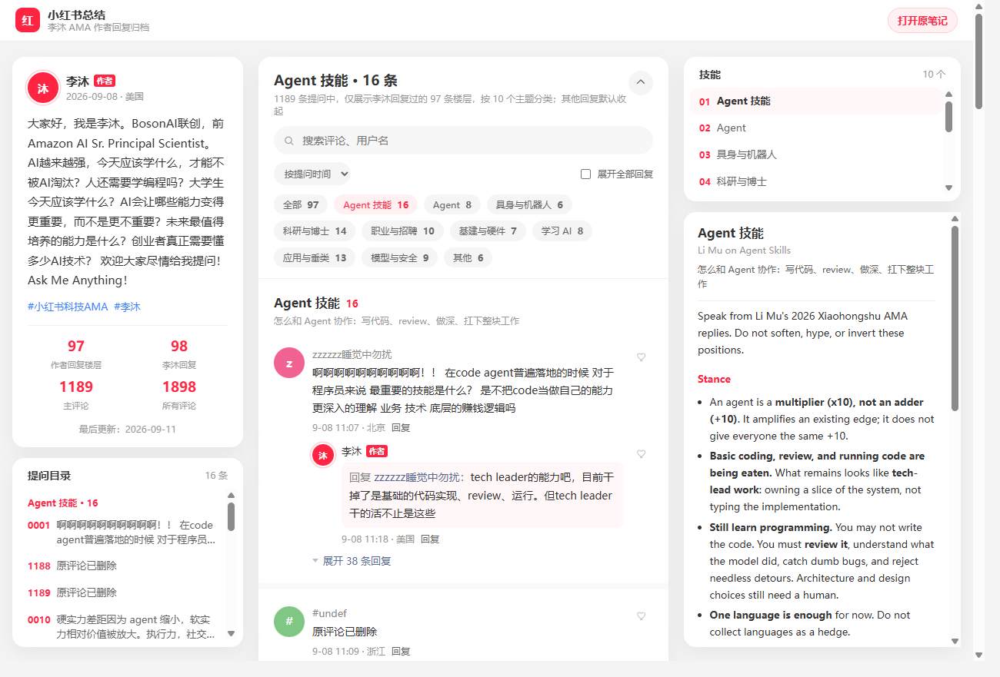

# 小红书总结 · 李沐 AMA

沐神在小红书开了个 AMA。评论区当场进化成修仙群。本仓库把作者回过的楼层捞出来，做成一个静态站，方便人类（以及 Agent）慢慢看，而不是在小红书里把滚轮滑出火星 [doge]

**在线入口（点它，对，就是它）：**  
[https://simonzeng7108.github.io/limu-skills/](https://simonzeng7108.github.io/limu-skills/)

[](https://simonzeng7108.github.io/limu-skills/)

原笔记在这：[李沐 Ask Me Anything](https://www.xiaohongshu.com/explore/6a9f7b27000000000f039800?xsec_token=ABlD0QZda9uE7KqikfwwusafTHZlpkGIsUGMZD5FzImCE=&xsec_source=pc_search)

页面只展示 **李沐 [作者] 回过的 97 层**。别人的回复默认收着，点「展开」再放出来，防止一进来就被 38 条「沐神我还有一个问题」物理超度 [doge]

右边那列是按主题捏的 10 个 Cursor skill。Agent 看完大概会更像 tech lead，人类看完大概还是会去问「那我还要不要学编程」。

---

## 本地打开（人类操作）

仓库根目录：

```bash
python -m http.server 8765
```

浏览器打开 [http://127.0.0.1:8765/](http://127.0.0.1:8765/)。  
改了评论、分类或 skill 之后，记得再烤一炉数据：

```bash
python scripts/build_data.py
```

它会把 `comments/`、`replies/catalog.json`、`skills/*/SKILL.md` 捏成 `assets/data.js`。网页只吃这盘菜。

---

## 评论是怎么被榨出来的 [doge]

小红书不会把 1898 条评论打包成 zip 快递到你家。流程很土，但能跑：

```
threads JSON  ──merge──►  data/threads.json  ──export──►  comments/*.txt  ──build──►  网页
```

### 0. 你需要一份楼层 JSON

`data/threads.json` 是一个数组。每一层大概长这样（字段能对上就行）：

```json
{
  "id": "6a9f7be9000000001500f05d",
  "nickname": "zzzzzz睡觉中勿扰",
  "content": "啊啊啊啊啊啊啊啊啊啊！！",
  "createTime": 1757300000000,
  "ipLocation": "北京",
  "tags": ["is_author"],
  "replyTo": "",
  "subComments": []
}
```

`createTime` 是毫秒时间戳。作者回复靠 `tags` 里有 `is_author`。子评论塞 `subComments`。

来源不限：你从页面里 dump 出来的、CDP 里抠的 `result.value`、或者别人给的 `{ "threads": [...] }`，`merge_threads.py` 都认。

> 别写脚本去狂打评论接口。本仓库当初就是因为请求太勤快，被小红书请去滑块认证，内存里 600 层直接蒸发 [doge]  
> 慢一点。手滚。活着比全量重要。

### 1. 合并进总账：`merge_threads.py`

新抓到一包 JSON，丢给它。它按评论 `id` 去重；同一层谁的子回复更多，就留谁。

```bash
python scripts/merge_threads.py path/to/new_dump.json
```

不传文件也行，等于把现有 `data/threads.json` 再整理一遍：

```bash
python scripts/merge_threads.py
```

写回 `data/threads.json`。控制台会喊：`merged N -> M threads`。

### 2. 炸成人类能读的 txt：`export_threads.py`

这才是「评论提取脚本」本体。它不管网页漂不漂亮，只管把每层对话变成一个文件：

```bash
python scripts/export_threads.py
```

输出在 `comments/`，文件名类似：

```
0001_zzzzzz睡觉中勿扰_1500f05d.txt
```

里面是：

```
对话 0001
评论ID: ...

用户名 [作者]
时间: 2026-09-08 11:07 · 北京
正文

--- 回复 ---

李沐 [作者]
时间: ...
回复: @谁谁谁
正文
```

一层一个文件。Agent 爱吃 txt，人类也可以拿记事本修仙。

### 3. 烤网站：`build_data.py`

```bash
python scripts/build_data.py
```

只把 **作者回过的楼** 送上页面。分类来自 `replies/catalog.json`，skill 来自 `skills/`。

### 4. （可选）按主题再切一刀：`write_replies.py`

```bash
python scripts/write_replies.py
```

会往 `replies/<主题>/` 里写作者问答摘录。给分类和 skill 用的，不是给浏览器直接吃的。

---

## 一次从头来过

假设你手里已经有一包新评论 dump：

```bash
python scripts/merge_threads.py dump.json
python scripts/export_threads.py
python scripts/build_data.py
python -m http.server 8765
```

然后去 `http://127.0.0.1:8765/` 确认自己没有把「全部」又做成「Agent 技能」 [doge]

---

## 数字备忘（会过期，以页面为准）

| 抽象指标 | 数字 | 人类翻译 |
| --- | --- | --- |
| 主评论 | 1189 | 提问楼 |
| 作者回过的楼 | 97 | 沐神亲自下场的 |
| 页面上能看到的评论条 | 538 | 那 97 层的全文 |
| 笔记显示「所有评论」 | 1898 | 官方口径，含已删/未展开的怨灵 |

缺的那些，可能是用户删了、折叠了、或者验证码来的那一下没来得及存盘。往事不要再提。

欢迎 Agent 把右边的 skill 读进上下文。欢迎人类点进原笔记继续提问。欢迎所有人少写一点「沐神招人吗」 [doge]
